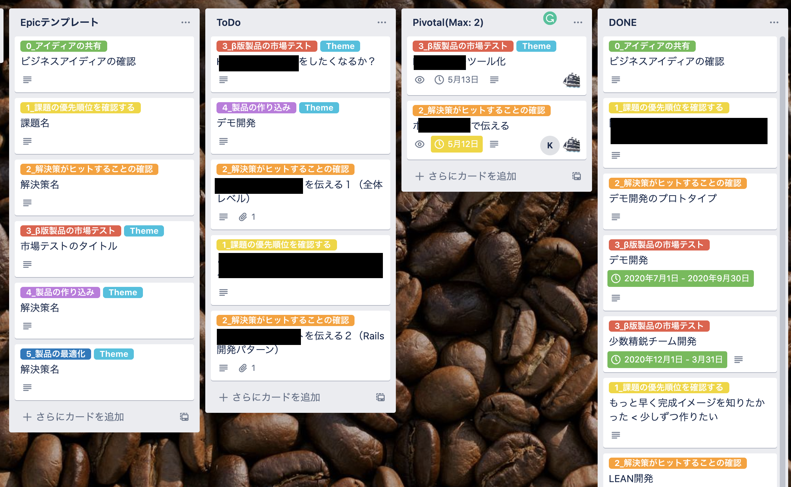
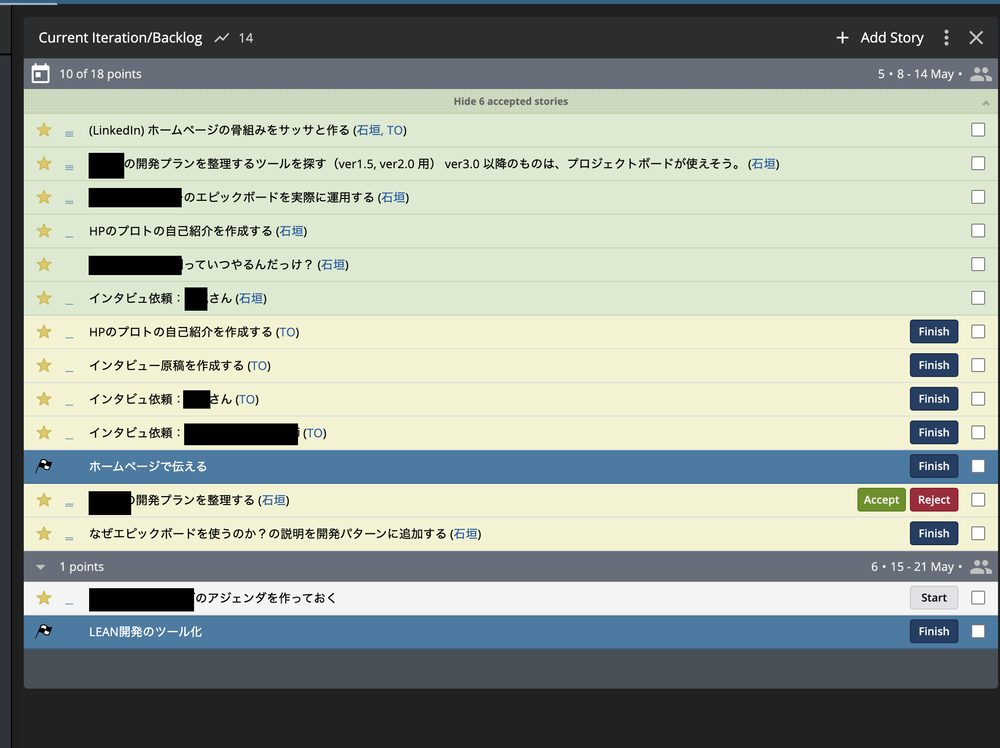

# 近いことは明確に、遠いことはザックリと

**適切な時期に、正しい行動をしましょう**

| 近いことは「状況を詳細に把握してハンドルを握る」くらいには明確に | 遠いことは「きっと通行できるだろうこの道を通る」程度にザックリと |
| --- | --- |
|  |  |

事業を進めていると、アイディアはどんどん出てくるし、先のことを考えたくなってしまいますが、一呼吸おきましょう。

## どうして？
### 問題１：遠くのことが気になってしまい、近くのことが不明瞭になると、いまやるべきことを間違える（またはリソース不足に陥る）

「いつかやるタスク」が残ったままになっていて「本当に手をつけるべきタスク」が埋もれてしまった経験はないでしょうか？

「いまやるべきこと」を間違えた結果、プロジェクト失敗になるのは避けたいところです。

### 問題２：遠いことを細かく決めすぎると、予想が外れたときのロスが大きい

| 計画を変えない場合 | 計画を変える場合 |
| --- | --- |
| 現実と乖離していくので、どこかで破綻する | そもそも緻密で長大な計画にはコストがかかる そのコストが無駄になる 再計画に、またコストがかかる |

## どうやって解決するの？
システム開発の世界には、["YAGNI"](https://ja.wikipedia.org/wiki/YAGNI)という言葉があります。
詳しい説明は、Wikipediaにありますが、大事なポイントを意訳すると「明確になるまで、計画や制作したい気持ちを我慢する」ということにあります。

アイデアが出てきたら、もっと考えたくなってしまうのが人間ですが、まずは気持ちを静めて、「もしも計画や制作を進めたあとで、これが不要だとわかったとき、あるいは、違う解決策がベストだとわかったとき、**ロスする時間と金額はどのくらいだろう？**」と立ち止まります。

立ち止まったうえで、以下、状況に応じて対応を変えます。

## 実現方法
### プロジェクト運営レベル
頭でわかっていても、プロジェクトを実行中は、とても忙しいので、ついアイデアを書き留めて、つい作業をしてしまい、あとで、アイデアの山に溺れがちです。そこで、自分の頭を使う代わりに、ツールに制御させることで、タスクの山が出来上がるのを防ぎます。

具体的には、エピックボードとPivotal Trackerを使った、「かんばん」方式と「Scrum」方式のハイブリッド運営で実現します。

| エピックボード | Pivotal Tracker |
| --- | --- |
| 必要性が明確になるまではザックリ認識しておくツール | 最優先課題を細かく管理するツール |
|  |  |

#### 使い方（ざっくり説明）
- １． アイデアをエピックボードに登録し、そのアイデアの元になっているビジネス的要求や顧客の痛み、そして解決策などを紐付けて整理します、課題の優先度をつけるために。
- ２. 課題の優先度を並び替えます。
- ３. 最優先課題をエピックボードのDoing（図中ではPivotal）に移動させます。
  - 移動後に、Pivotal Trackerにて、細かい作業を登録して、並び替え、優先度の高いものから順に作業します。
- ４. 最優先課題のタスクが全て終わったら、Doneに移動して、2に戻ります。

なお、エピックボードのEpicテンプレートには、各フェーズでやるべきことが、記載されていて、途中でアイデアを思いついてしまった場合にメモを残しておくスペースも用意しています。

### プログラムレベル
プログラムには、プログラムを組むよりも、そのあとの修正コストのほうが高い場合があるという特性があります。
（現実世界に置き換えた例としては、小説の主人公の性別を入れ替える修正は、たった１つの修正ですが、本の全体に影響があります）

プログラムにおいては、前述の"YAGNI"を実践するためには、「組んだプログラムの修正コストが上がらないようにコントロールする」という技術が必要です。たとえば、[オブジェクト指向設計](https://gihyo.jp/book/2016/978-4-7741-8361-9)や[デザインパターン](https://refactoring.guru/design-patterns)などの設計原則の適用や、[継続的インテグレーション](https://ja.wikipedia.org/wiki/%E7%B6%99%E7%B6%9A%E7%9A%84%E3%82%A4%E3%83%B3%E3%83%86%E3%82%B0%E3%83%AC%E3%83%BC%E3%82%B7%E3%83%A7%E3%83%B3)や[自動テスト](https://tech-camp.in/note/technology/47921/)などによる支援があります。こういったことができるエンジニアがプログラムを組むと、YAGNIを達成しやすくなります。

## 関連する開発パターン
（ここはβ版）
- 操縦席ナビ
  - 仮説検証
  - UX設計
- 開発力ターボエンジン
  - 手戻り最小化
- 個人の開発力
  - 設計原則
